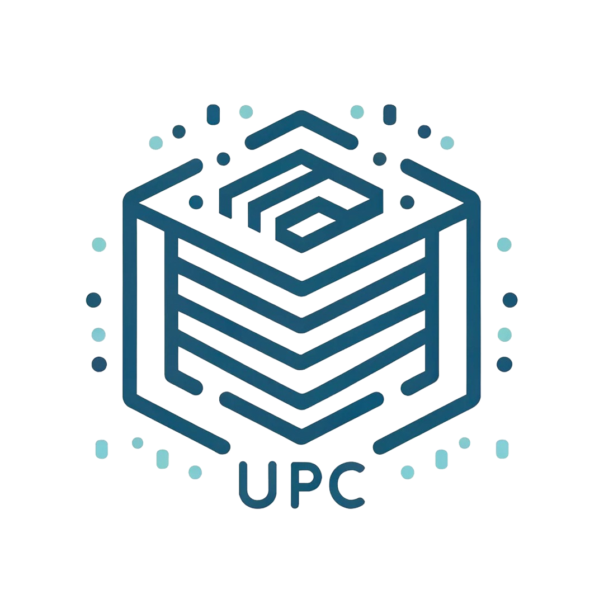
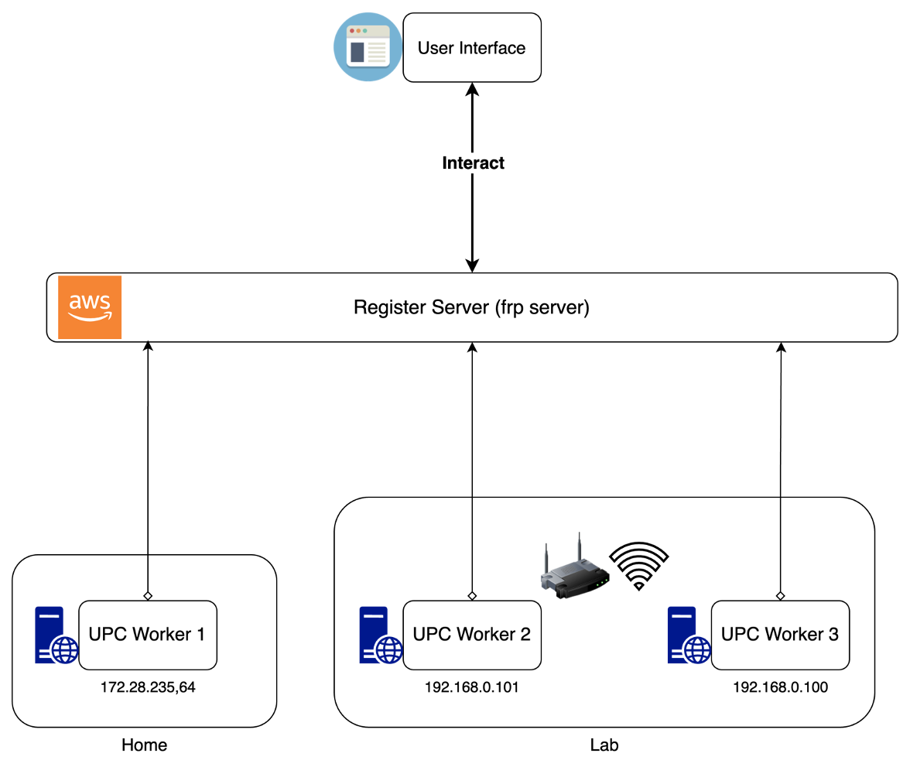
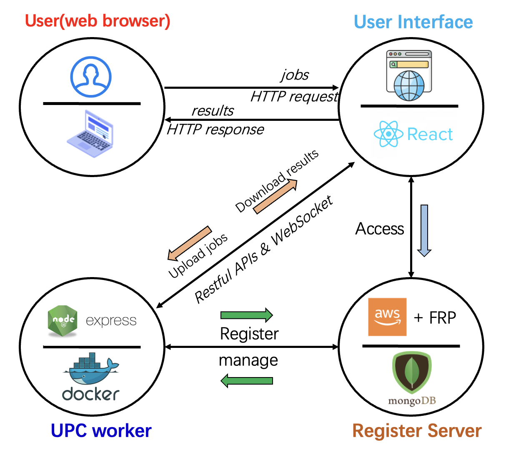
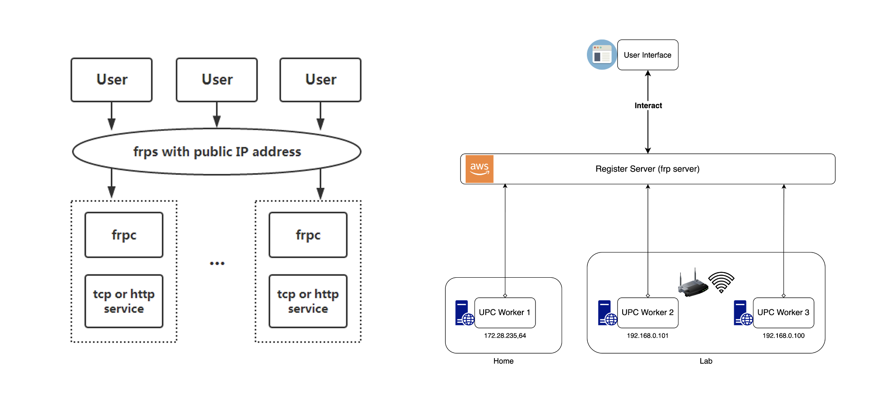
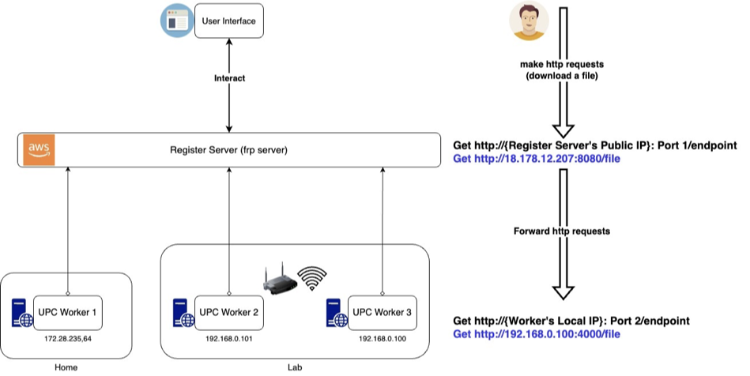
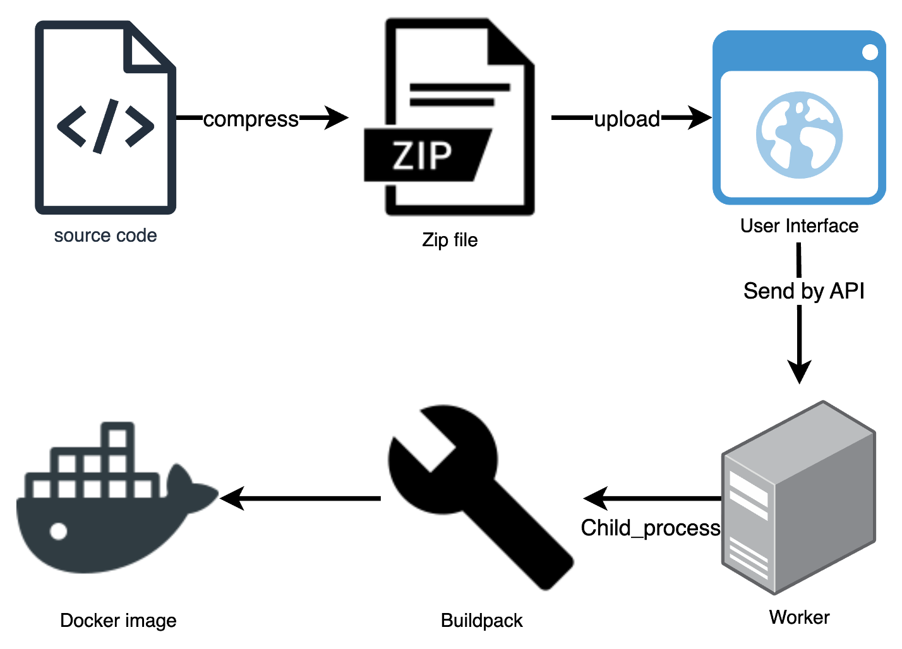
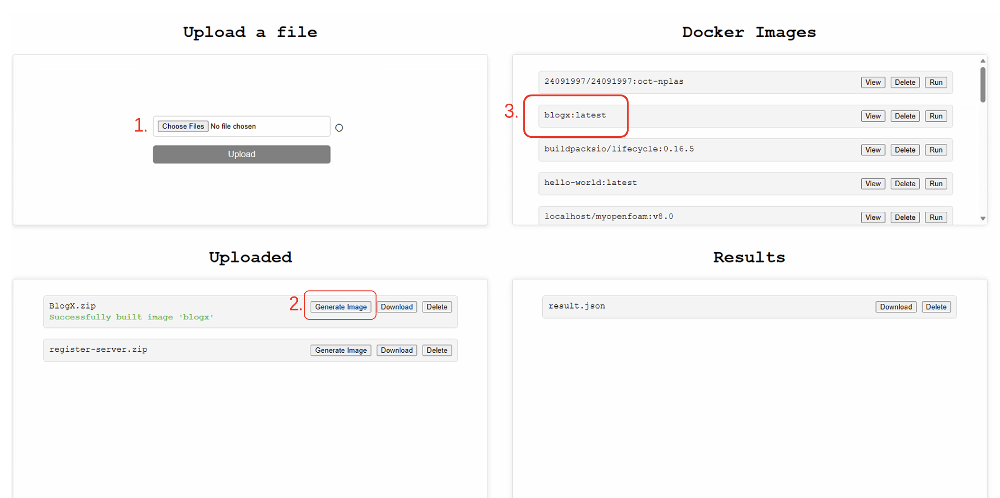
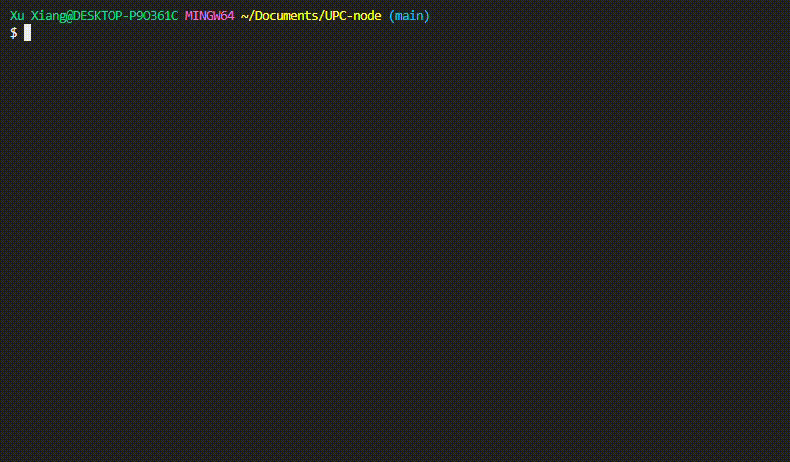

<div align="center">

</div>
<h1 align="center">UPC-node</h1>
<p align="center">(User-PC Computing System)</p>

A full-stack computational system using Docker, buildpack to simplify the processing of all kind of tasks.

---

## Features

- **Process jobs**: Process different kinds of jobs in various backend hosts in the system.
- **File management**: Upload/Delete files in the backend-server.
- **Docker Image Generation**: Generate Docker images through uploaded zip file using Buildpack.
- **Terminal integration**: Expose backend host terminal to frontend to let users to execute commands.
- **Server registration**: Register and manage backend API servers/frontend React servers by Register-Server(loacl or cloud).
- **Database Integration**: Store and manage data in MongoDB(cloud).
- **Deploy by Docker using shell script**: Deploy the whole system by running a command.

---

## Architecture of the UPC system

The UPC system consisted three main components:
1. **UPC-Worker** (backend server)
2. **User Interface** (React frontend)
3. **Register Server** (A cloud or local central server to manage the system)

--- 

## Workflow of the UPC system


---

## Principle of accessing from outside by Frp

Frp is a fast reverse proxy that allows you to expose a server(service) from a local network.

Frp forwards requests to internal services via a server with a Public IP.



---

## Docker image auto generation Process


The order to generate a Docker image in UPC system:


---

# Getting Started

## Deploy and run using Docker (recommended)



### Script (copy&paste to your terminal to run):


- Whole UPC system:
```bash
curl -sSL https://raw.githubusercontent.com/comevback/UPC-node/main/start-docker.sh -o start-docker.sh &&
chmod +x start-docker.sh &&
./start-docker.sh
```

- (Backend only) API-service:
```bash
curl -sSL https://raw.githubusercontent.com/comevback/UPC-node/main/start-api-docker.sh -o start-api-docker.sh &&
chmod +x start-api-docker.sh &&
./start-api-docker.sh
```
- for x86 arch host:
```bash
curl -sSL https://raw.githubusercontent.com/comevback/UPC-node/main/start-x86-api-docker.sh -o start-x86-api-docker.sh &&
chmod +x start-x86-api-docker.sh &&
./start-x86-api-docker.sh
```

- (Frontend only) Frontend-service:
```bash
curl -sSL https://raw.githubusercontent.com/comevback/UPC-node/main/start-react-docker.sh -o start-react-docker.sh &&
chmod +x start-react-docker.sh &&
./start-react-docker.sh
```

- Register-service:
```bash
curl -sSL https://raw.githubusercontent.com/comevback/UPC-node/main/start-register-docker.sh -o start-register-docker.sh &&
chmod +x start-register-docker.sh &&
./start-register-docker.sh
```

### Docker command:

- Whole UPC system:
```bash
docker run -it --rm -e HOST_URL={http://your_API_host:4000} -e CENTRAL_SERVER={http://your_central_server:8000} -e INITIAL_API_URL={http://your_API_host:4000} -e INITIAL_CENTRAL_SERVER_URL={http://your_central_server:8000} -v /var/run/docker.sock:/var/run/docker.sock -p 3000:3000 -p 4000:4000 -p 8000:8000 afterlifexx/upc-system
```

for example:
```bash
docker run -it --rm -e HOST_URL=http://192.168.0.103:4000 -e CENTRAL_SERVER=http://192.168.0.103:8000 -e INITIAL_API_URL=http://192.168.0.103:4000 -e INITIAL_CENTRAL_SERVER_URL=http://192.168.0.103:8000 -v /var/run/docker.sock:/var/run/docker.sock -p 3000:3000 -p 4000:4000 -p 8000:8000 afterlifexx/upc-system
```

```bash
docker run -it --rm -e HOST_URL=http://172.28.235.225:4000 -e CENTRAL_SERVER=http://172.28.235.225:8000 -e INITIAL_API_URL=http://172.28.235.225:4000 -e INITIAL_CENTRAL_SERVER_URL=http://172.28.235.225:8000 -v /var/run/docker.sock:/var/run/docker.sock -p 3000:3000 -p 4000:4000 -p 8000:8000 afterlifexx/upc-system
```

- (Backend only) API-service:
```bash
docker run -it --rm -e HOST_URL={http://your_API_host:4000} -e CENTRAL_SERVER={http://your_central_server:8000} -v /var/run/docker.sock:/var/run/docker.sock -p 4000:4000 afterlifexx/upc-api
```
- for example( API service ):
```bash
docker run -it --rm -e HOST_URL=http://172.28.235.64:4000 -e CENTRAL_SERVER=http://172.28.235.225:8000 -v /var/run/docker.sock:/var/run/docker.sock -p 4000:4000 afterlifexx/upc-api
```

- (Frontend only) Frontend-service:
```bash
docker run  -e REACT_APP_INITIAL_API_URL={http://your_API_host:4000} -e REACT_APP_INITIAL_CENTRAL_SERVER_URL={http://your_central_server:8000} -p 3000:3000 afterlifexx/upc-react
```

- Register-service:
```bash
docker run  -it --rm -p 8000:8000 afterlifexx/upc-register
```


---

## Deploy Project

These instructions will get you a copy of the project up and running on your local machine for development.

### Prerequisites

- Node.js: https://nodejs.org/en/download
- Docker: https://www.docker.com
- buildpack: https://buildpacks.io/docs/tools/pack
- MongoDB(optional): https://www.mongodb.com

## Installing

1. **Clone the repository**:

```bash
git clone https://github.com/comevback/UPC-node.git
cd UPC-node
```

2. **Install dependencies for the all**:

- Linux/MacOS:
```bash
npm run install-all
```
or
```bash
chmod +x install.sh
./install.sh
```

- Windows:
(If you are using Windows, please use *git bash* or other kinds of bash)
```bash
chmod +x install.sh
./install.sh
```

3. **Run the setup scripts to change the ip address of backend server to your host ip address**
```bash
chmod +x setArgs.sh
./setArgs.sh
```

## Usage

*If you want to use Database to store the registered service, create a .env file on register-server folder, and add a line as:*
```.env
MongoURL={your-mongoDB-RUL}
```

*otherwise the data will be loacl.*

**Run Frontend-Server Backend-Server and Register-Server at the same time:**

```bash
npm start
```

**Or run individual part:**

- Register-Server:
```bash
cd register-server
npm start
```

- Backend-Server:
```bash
cd backend/UPC-nodejs
npm start
```

- Frontend-Server:
```bash
cd frontend/upc-react
npm start
```

## Demo


1. Start the React(frontend) API(backend) servers and Register-Server.
2. Compress the directory of the task in to .zip file,
3. Upload the compressed file on React website,
4. Generate a image for this kind of task,
5. Upload files and process,
6. Download the results.

## Contributing

Xu Xiang

## License

This project is licensed under the MIT License - see the [LICENSE](LICENSE) file for details.
