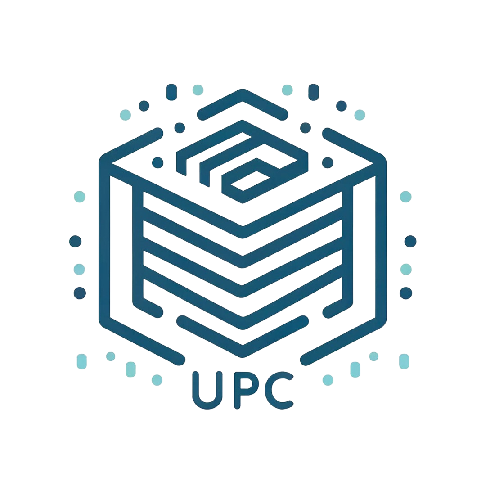
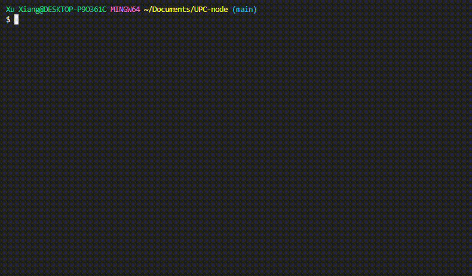
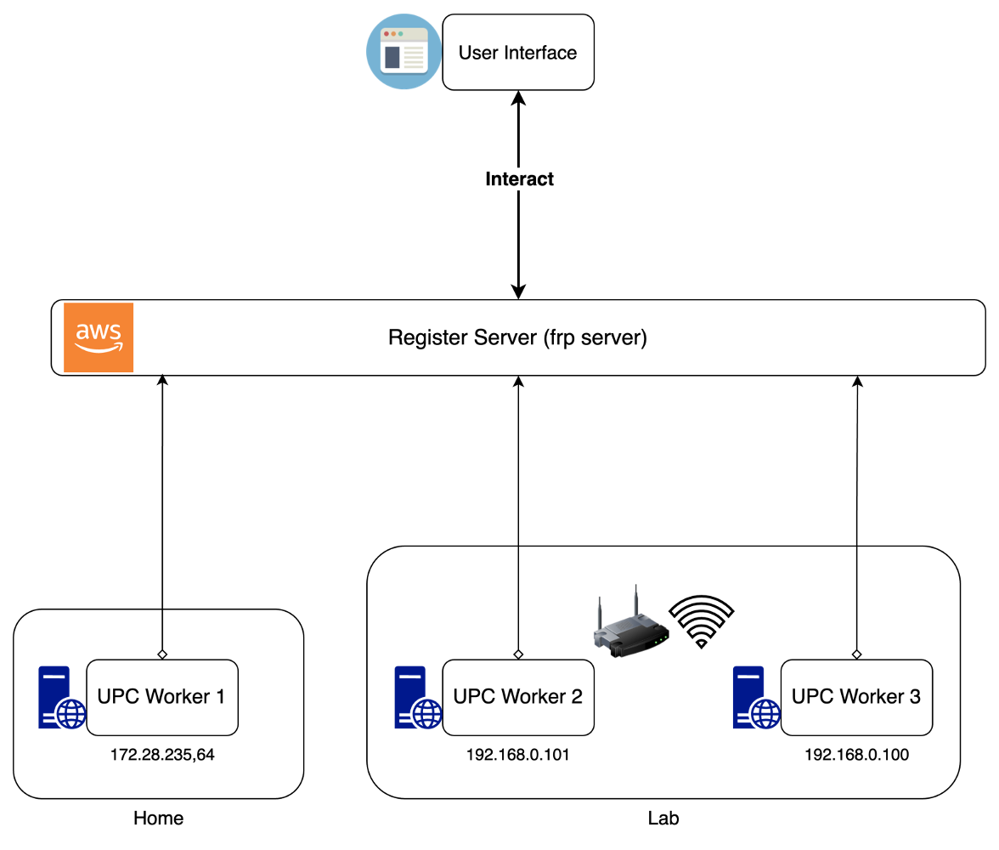
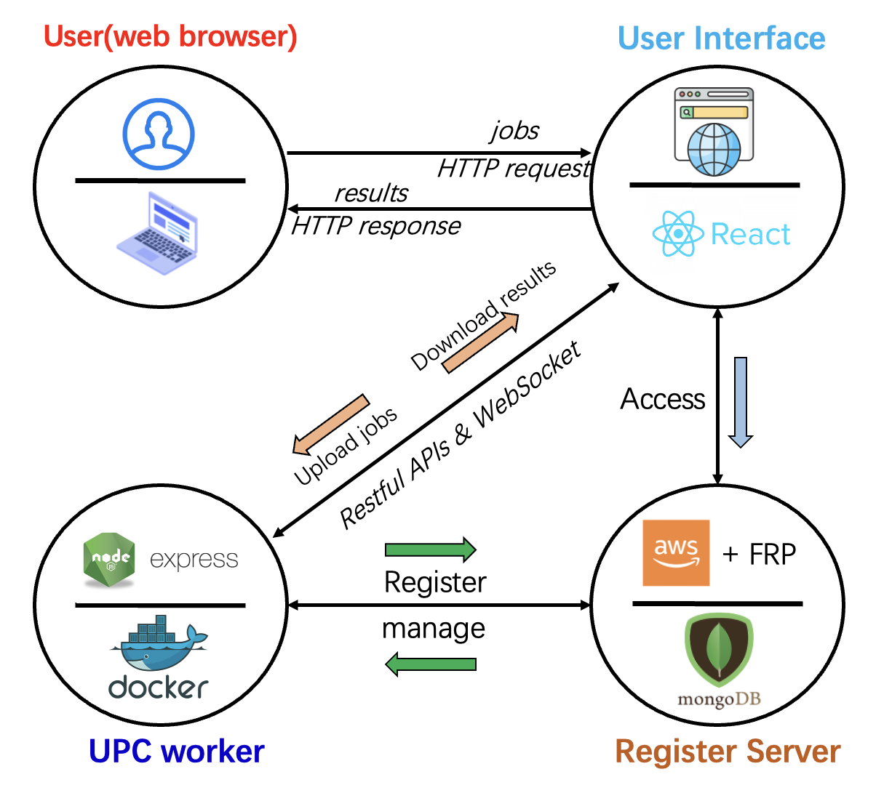

<div align="center">

</div>
<h1 align="center">UPC-node</h1>
<p align="center">（User-PC Computing System）</p>

使用Docker和Buildpack的全栈计算系统，简化各种任务的处理。

---

### 用Docker快速启动

```bash
curl -sSL https://raw.githubusercontent.com/comevback/UPC-node/main/start-docker.sh -o start-docker.sh &&
chmod +x start-docker.sh &&
./start-docker.sh
```



---

## 特点

这个系统使用户可以通过网页浏览器轻松操作Docker。以下是其主要功能：

- **文件管理**: 上传和删除文件。
- **Docker镜像生成**: 从上传的文件中创建Docker镜像。
- **任务处理**: 在后端执行各种任务。
- **终端访问**: 直接从网页浏览器执行命令。
- **服务器管理**: 注册和管理本地或云端服务器。
- **Docker部署**: 通过一个命令部署整个系统。

简而言之，这个系统允许用户通过网页界面操作Docker，以创建、获取（pull）和删除Docker镜像。此外，通过面板帮助用户更快速、简便地使用Docker容器。

---

# 概念

---

## UPC系统架构

UPC系统包括三个主要组件：
1. **UPC-Worker**（后端服务器）
2. **用户界面**（React前端）
3. **注册服务器**（管理系统的云端或本地中央服务器）

--- 

## UPC系统的工作流程


---

## 通过Frp从外部访问的原理

Frp是一个快速反向代理，允许您从本地网络公开服务器（服务）。

Frp通过具有公共IP的服务器转发请求到内部服务。


---

## Docker镜像自动生成过程


在UPC系统中生成Docker镜像的步骤：


---

# 使用方法

---

## 使用Docker部署和运行（推荐）


### 脚本（复制并粘贴到您的终端运行）:


- 整个UPC系统：
```bash
curl -sSL https://raw.githubusercontent.com/comevback/UPC-node/main/start-docker.sh -o start-docker.sh &&
chmod +x start-docker.sh &&
./start-docker.sh
```

- Go-Server：
```bash
curl -sSL https://raw.githubusercontent.com/comevback/UPC-node/main/start-go-docker.sh -o start-go-docker.sh &&
chmod +x start-go-docker.sh &&
./start-go-docker.sh
```

- Node-Server（不推荐）：
```bash
curl -sSL https://raw.githubusercontent.com/comevback/UPC-node/main/start-api-docker.sh -o start-api-docker.sh &&
chmod +x start-api-docker.sh &&
./start-api-docker.sh
```

- （仅前端）前端服务：
```bash
curl -sSL https://raw.githubusercontent.com/comevback/UPC-node/main/start-react-docker.sh -o start-react-docker.sh &&
chmod +x start-react-docker.sh &&
./start-react-docker.sh
```

- 注册服务：
```bash
curl -sSL https://raw.githubusercontent.com/comevback/UPC-node/main/start-register-docker.sh -o start-register-docker.sh &&
chmod +x start-register-docker.sh &&
./start-register-docker.sh
```

---

## 使用Node.js部署项目

这些指南将帮助您在本地机器上获取并运行项目副本，用于开发。

### 前提条件

- Node.js: https://nodejs.org/en/download
- Docker: https://www.docker.com
- buildpack: https://buildpacks.io/docs/tools/pack
- MongoDB（可选）: https://www.mongodb.com

## 安装步骤

1. **克隆仓库**：

```bash
git clone https://github.com/comevback/UPC-node.git
cd UPC-node
```

2. **为所有部分安装依赖**：

- Linux/MacOS:
```bash
npm run install-all
```
或者
```bash
chmod +x install.sh
./install.sh
```

- Windows:
（如果您使用Windows，请使用*git bash*或其他bash）
```bash
chmod +x install.sh
./install.sh
```

3. **运行设置脚本，将后端服务器的IP地址更改为您的主机IP地址**:
```bash
chmod +x setArgs.sh
./setArgs.sh
```

## 使用Node.js启动

*如果您想使用数据库来存储注册服务的数据，请在register-server文件夹中创建.env文件，并添加以下行：*
```.env
MongoURL={your-mongoDB-URL}
```

*否则，数据将存储在本地。*

**同时运行前端服务器、后端服务器和注册服务器**：

```bash
npm start
```

**或者单独运行各个部分**：

- 注册服务器：
```bash
cd register-server
npm start
```

- 后端服务器：


```bash
cd backend/UPC-nodejs
npm start
```

- 前端服务器：
```bash
cd frontend/upc-react
npm start
```

## 演示


1. 启动React（前端）、API（后端）服务器和注册服务器。
2. 将任务目录压缩成.zip文件。
3. 在React网站上上传压缩文件。
4. 为这种任务生成一个镜像。
5. 上传文件并处理。
6. 下载结果。

## 贡献者

Xu Xiang

## 许可证

该项目在MIT许可证下授权 - 详情请见[LICENSE](LICENSE)文件。